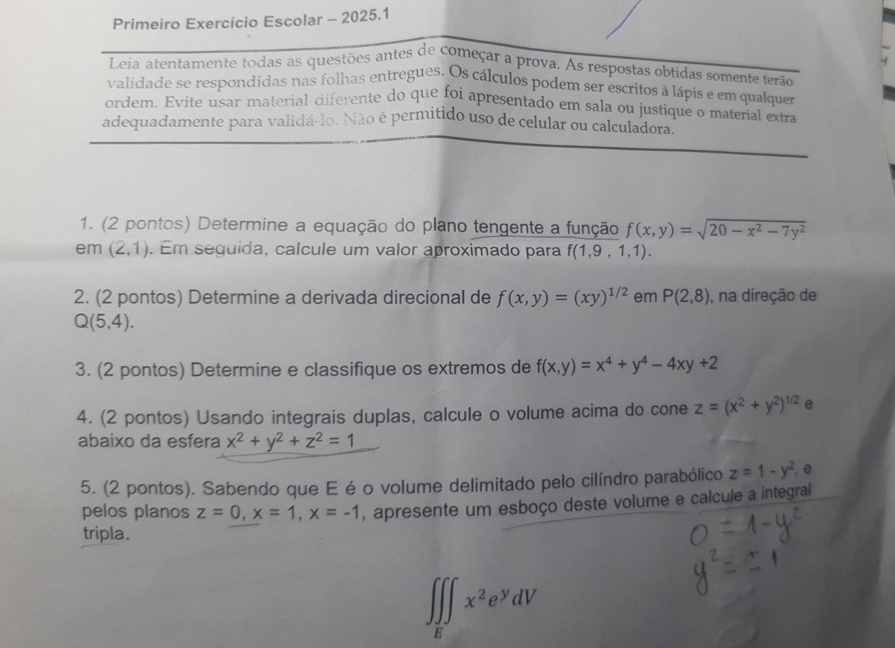

# Handmark

Handmark is a Python CLI tool that converts handwritten notes from images into Markdown files. It uses AI to process the images and extract the text.

## Features

* Converts images of handwritten notes to Markdown.
* Simple CLI interface.
* Uses Azure AI for image processing.

## Installation

```bash
pip install .
```

## Usage

To use Handmark, run the following command in your terminal:

```bash
handmark <image_path>
```

Replace `<image_path>` with the path to the image file you want to convert. The output will be saved as `response.md` in the current directory.

### Example

Input image (`samples/prova.jpeg`):



Output (`prova-response.md`):

[Link to prova-response.md](prova-response.md)

## Development

This project uses `uv` for package management.

### Setup

1. Clone the repository:

   ```bash
   git clone https://github.com/your-username/handmark.git
   cd handmark
   ```

2. Install dependencies:

   ```bash
   uv pip install -e .
   ```

    or

    ```bash
    pip install -e .
    ```

## Contributing

Contributions are welcome! Please open an issue or submit a pull request.

## License

This project is licensed under the MIT License.
