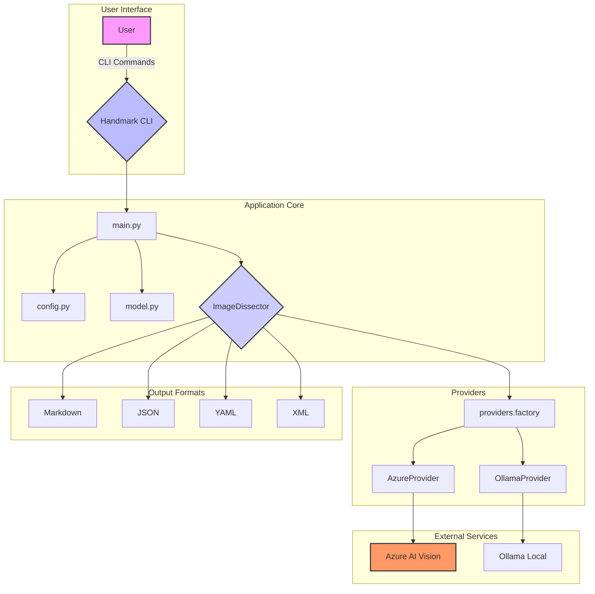

# Handmark

**Handmark** is a Python CLI tool that converts handwritten notes from images into structured documents. It supports multiple AI providers (Azure AI and Ollama) and output formats (Markdown, JSON, YAML, XML), making it easy to digitize handwritten content with flexible processing options.

[](https://github.com/devgabrielsborges/handmark/blob/main/LICENSE)
[](https://github.com/devgabrielsborges/handmark)

## Key Features

✨ **Multi-Format Document Generation**
:   Transform handwritten notes into Markdown, JSON, YAML, or XML

:brain: **Intelligent Title Extraction**
:   Automatically detects and extracts titles from content for smart file naming

🤖 **Dual AI Provider Support**
:   Choose between Azure AI (remote) or Ollama (local) for processing

⚡️ **Easy CLI Interface**
:   Simple, intuitive commands with rich console output and comprehensive error handling

🔧 **Advanced Model Configuration**
:   Select from multiple AI models with availability validation

🔒 **Secure Authentication**
:   GitHub token-based authentication with secure local storage

📁 **Flexible Output**
:   Customize output directory and filename options with intelligent fallbacks

🏠 **Local Processing Option**
:   Use Ollama for completely local, offline image processing

## Quick Start

Get up and running with Handmark in three simple steps:

=== "pip"

    ``` bash
    # Install Handmark
    pip install handmark

    # Configure authentication
    handmark auth

    # Process your first image
    handmark digest path/to/your/image.jpg
    ```

=== "uv"

    ``` bash
    # Install Handmark with uv
    uv pip install handmark

    # Configure authentication
    handmark auth

    # Process your first image
    handmark digest path/to/your/image.jpg
    ```

!!! success "That's it!"
    Your handwritten notes will be converted to a Markdown file automatically.

## Architecture Overview



## Example Usage

Here's a real-world example of Handmark processing handwritten mathematical content:

### Input Image


*Handwritten mathematics exam with complex equations and instructions*

### Processing Command

```bash
handmark digest samples/prova.jpeg -f markdown
```

### Output Result

The tool automatically:

- :material-eye: **Analyzes** the handwritten content
- :material-text-recognition: **Extracts** text and mathematical notation
- :material-format-title: **Detects** the title "Primeiro Exercício Escolar - 2025.1"
- :material-file-check: **Converts** to properly formatted Markdown with LaTeX

??? example "View full output"

    ``` markdown
    # Primeiro Exercício Escolar - 2025.1

    Leia atentamente todas as questões antes de começar a prova. As respostas
    obtidas somente terão validade se respondidas nas folhas entregues. Os
    cálculos podem ser escritos à lápis e em qualquer ordem. Evite usar
    material diferente do que foi apresentado em sala ou justifique o material
    extra adequadamente para validá-lo. Não é permitido uso de celular ou
    calculadora.

    1. (2 pontos) Determine a equação do plano tangente a função$f(x,y) = \sqrt{20 - x^2 - 7y^2}$ em (2,1).
       Em seguida, calcule um valor aproximado para $f(1,9 , 1,1)$.

    2. (2 pontos) Determine a derivada direcional de$f(x,y) = (xy)^{1/2}$ em $P(2,8)$, na direção de $Q(5,4)$.

    3. (2 pontos) Determine e classifique os extremos de$f(x,y) = x^4 + y^4 - 4xy + 2$

    4. (2 pontos) Usando integrais duplas, calcule o volume acima do cone$z = (x^2 + y^2)^{1/2}$ e abaixo da esfera $x^2 + y^2 + z^2 = 1$

    5. (2 pontos). Sabendo que E é o volume delimitado pelo cilindro
       parabólico$z = 1 - y^2$, e pelos planos $z = 0$, $x = 1$, $x = -1$,
       apresente um esboço deste volume e calcule a integral tripla.

    $$
    \iiint_E x^2e^y dV
    $$
    ```


!!! success "Perfect OCR Accuracy"
    Notice how Handmark correctly interprets complex mathematical notation,
    preserves formatting, and even captures the instructions at the top of
    the exam!

## What's Next?

!!! tip "Ready to get started?"

    Check out the[Installation](installation.md) guide to set up Handmark on your system, or jump to the [Quick Start](quickstart.md) for a hands-on tutorial.

## Learn More

- :octicons-book-16: [Installation Guide](installation.md) - Set up Handmark on your system
- :octicons-rocket-16: [Quick Start](quickstart.md) - Get started in 5 minutes
- :octicons-terminal-16: [Usage Guide](usage.md) - Comprehensive command reference
- :octicons-gear-16: [Configuration](configuration.md) - Customize Handmark behavior
- :octicons-question-16: [Troubleshooting](troubleshooting.md) - Common issues and solutions
